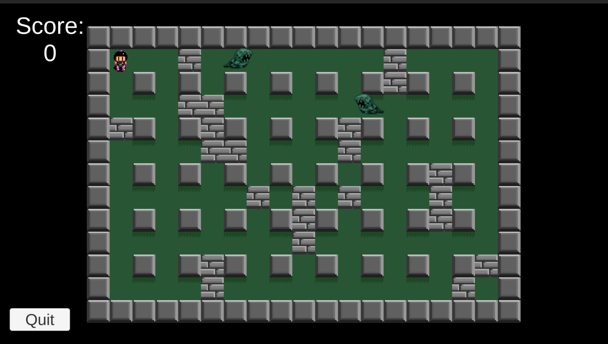
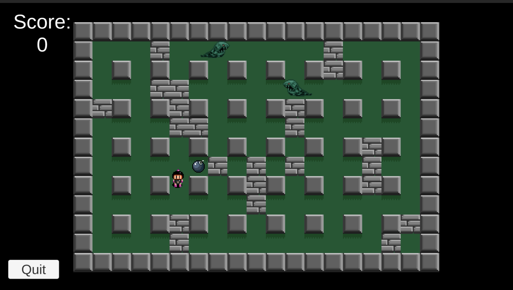
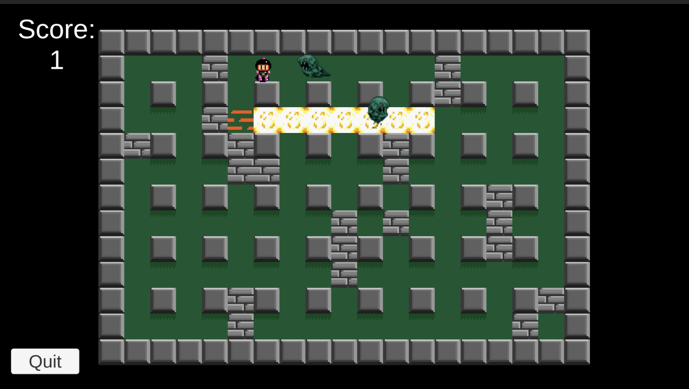
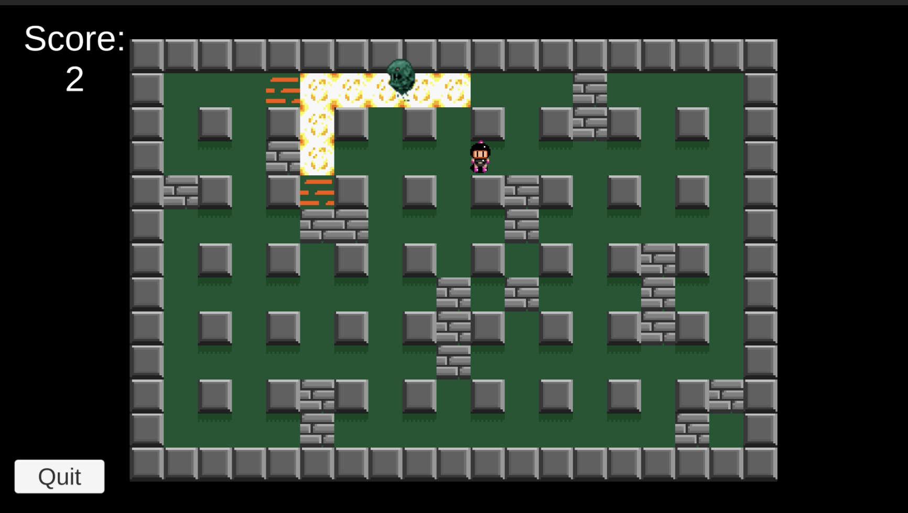

# 💣 Bomberman
**A 2D recreation of the classic arcade action-strategy game, built with Unity and C#.**

[](https://unity.com/)
[](#)

This project is a technical implementation of a **Grid-Based Combat System**. It features destructible environments, power-up systems, and AI-controlled enemies, all while maintaining the high-intensity strategic gameplay of the original Bomberman series.

---

## 📸 Media Gallery

### Gameplay Preview
| **Screenshot 1** | **Screenshot 2** | **Screenshot 3** | **Screenshot 4** |
| :---: | :---: | :---:| :---:|
|  |  |  |  |

---

## 🛠 Features & Mechanics

### 1. Grid-Locked Movement & Placement
Unlike free-roaming 2D games, Bomberman requires strict adherence to a grid.
* **Logic:** Implemented a system that snaps bomb placements to the center of grid cells, ensuring that explosion rays align perfectly with the corridors.
* **Physics:** Used custom raycasting to detect "Soft Blocks" (destructible) vs. "Hard Blocks" (indestructible) during an explosion.

### 2. Recursive Explosion Algorithm
The core of the game is the explosion logic. When a bomb detonates, it triggers a recursive search in four directions (North, South, East, West).
* **Collision Detection:** The explosion propagates until it hits a Hard Block, destroys a Soft Block, or reaches its maximum `BlastRadius`.
* **Chain Reactions:** If an explosion hit another bomb, it triggers an immediate detonation, requiring a robust **Event System** to handle simultaneous calculations.

### 3. Smart Enemy AI
Enemies use a state-driven approach to navigate the maze.
* **Pathfinding:** Implemented a lightweight version of **A* Pathfinding** or Breadth-First Search (BFS) to allow enemies to track the player while avoiding active bomb blast zones.
* **Difficulty Scaling:** Different enemy types have varying movement speeds and decision-making logic.

---

## 💻 Technical Implementation Detail

### The "Bomb & Blast" System
The explosion is not just a visual effect; it is a series of **OverlapSphere** or **Raycast** checks that interact with an `IDestructible` interface.


### Power-Up Persistence
Implemented a **Decorator Pattern** or a simple component-based buff system to handle:
* **Speed Boosts:** Modifying the player's `NavMesh` or `Transform` speed.
* **Blast Increase:** Incrementing the integer `BlastRadius` passed to the explosion algorithm.
* **Extra Bombs:** Managing a `BombCount` semaphore to limit active bombs on screen.

---

## 🏗 Project Architecture
```text
Bomberman/
├── Assets/
│   ├── _Project/
│   │   ├── Scripts/         # Bomb logic, Player Controller, AI, Grid Manager
│   │   ├── Prefabs/         # Player, Bombs, Destructible/Indestructible blocks
│   │   ├── ScriptableObjs/  # Level configurations and Power-up stats
│   │   └── VFX/             # Particle systems for explosions
│   └── Media/               # Screenshots and Demo Videos

## 🎓 What I Learned

### 🛠 Architecture & Logic
**Grid-Based Math:** Mastering coordinate conversion (World Space to Grid Space) to ensure gameplay precision.
**Object Oriented Design:** Utilizing the Observer Pattern to notify the GameManager when all enemies are destroyed or the player is hit.
**Coroutines:** Using Coroutines for the "fuse" timing and the sequential visual expansion of the fire trail.

### 🎨 Optimization & VFX
* **Layer Masking:** Using LayerMasks in Raycasts to significantly improve performance by ignoring the ground and purely checking for obstacles.
* **Particle Pooling:** Reusing explosion particle effects to prevent memory spikes during large chain reactions.

### 📈 Project Management
* **Modularization:** Learned how to structure a Unity project so that art assets, UI, and core logic are isolated, allowing for parallel development.